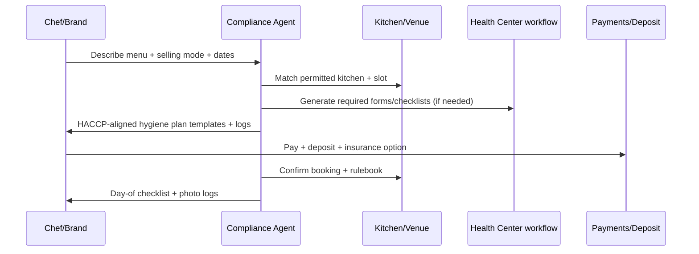
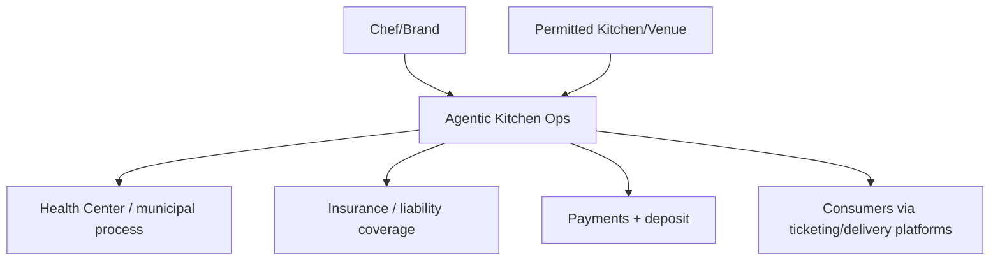
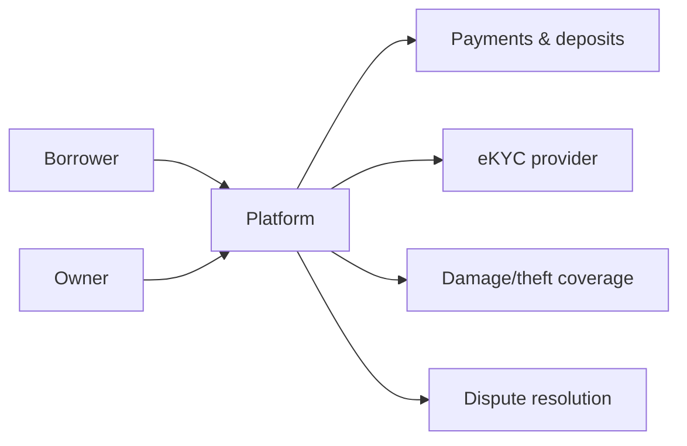
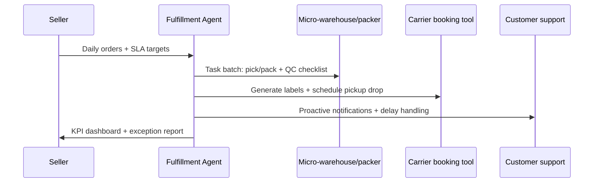
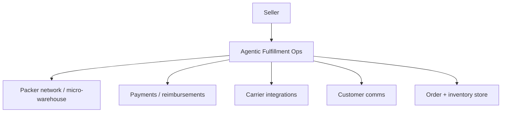
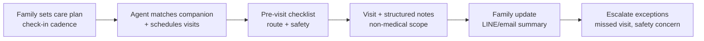
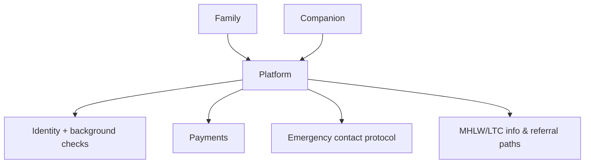

# Agentic Services in Japan: Niche Opportunities With Low Barriers to Entry

## Executive summary

Japan is unusually fertile ground for **agentic services**—AI systems that can execute multi-step workflows across tools and stakeholders—because supplier–demand markets are (a) fragmented into many small operators, (b) “paper and process heavy,” and (c) increasingly constrained by labor availability and demographic change. Japan’s **B2C e-commerce market reached ¥24.8 trillion in 2023** (METI), indicating a large and still-growing base of micro-merchants and consumers who already transact digitally but still face analog friction in scheduling, logistics, and exception handling. citeturn3view0 Japan’s demographic profile adds persistent coordination pressure: **29.1% of the population was aged 65+ as of Oct 1, 2023** (Cabinet Office), increasing demand for home-based services and family-coordinated support. citeturn10view0

A Japan-specific constraint (and opportunity) is that many “simple” marketplaces become complex once they touch compliance: food businesses must implement HACCP-aligned hygiene management in principle (MHLW), freelancing transactions are governed by a new freelancer protection law (English official translation), and personal data handling is regulated under APPI with PPC enforcement. citeturn0search1turn0search6turn0search4turn0search0 These constraints raise barriers for generic platforms—but they also create defensible wedges for **agentic compliance automation**, where the product is “do the regulated workflow correctly and fast,” not “listings.”

This report maps Japan-specific supplier–demand frictions to primary Japanese sources and proposes **10 low-barrier niches**. “Low barrier” here means: you can pilot as a software/service layer without owning regulated assets, without becoming a licensed operator, and by partnering with already-permitted suppliers. The top five pilot-ready niches are:

- **Micro-venue operations agent** for rental spaces listed on large aggregates (SpaceMarket/Instabase each report 30,000+ listings) to automate scheduling, deposits, usage-rule enforcement, and disputes. citeturn11search3turn11search4  
- **Shared kitchens & pop-up food compliance agent** to match chefs/brands to permitted kitchens and automate hygiene records and event paperwork, anchored by HACCP requirements and local health-center processes. citeturn0search1turn1search6  
- **Neighborhood equipment rental agent** (tools/party gear) that embeds identity verification norms (eKYC) and deposits/insurance workflows to reduce damage/fraud. citeturn2search2turn2search0  
- **D2C micro-fulfillment coordinator** (pick/pack scheduling + returns orchestration) riding Japan’s large B2C and C2C markets and Japan-specific payment preferences (bank transfer/konbini). citeturn3view0turn4search7  
- **Non-medical elder companionship and check-in scheduling** (family-coordinated) leveraging demographic need while avoiding regulated “care” scope. citeturn10view0turn4search17

For these top five, the report provides concrete agentic patterns, Mermaid user flows and stakeholder diagrams, KPIs, an 8–12 week pilot playbook for Japan, and a TAM/SAM/SOM model with sensitivity ranges.

## Japan-specific supplier–demand friction landscape

Japan’s supplier–demand markets share universal frictions (matching, scheduling, trust, payments), but several **Japan-specific features** shape where agentic automation has the highest ROI.

Personal data and trust are formalized through APPI and PPC enforcement. If an agent handles profiles, location, identity documents, health-adjacent details, or background checks, it is operating in an APPI environment governed by the **Act on the Protection of Personal Information** (official translation) and PPC guidance/oversight. citeturn0search4turn0search0 In practice, this means that “agentic” systems must treat **data minimization, purpose specification, breach handling, and vendor management** as first-class design constraints rather than afterthoughts.

Identity verification norms are strongly shaped by financial-sector rules for non-face-to-face verification. The FSA publishes Q&A on online identity verification methods under the Act on Prevention of Transfer of Criminal Proceeds, describing the evolution of online identity verification methods and their regulatory framing. citeturn2search2 For marketplaces that need deposits, insurance, age checks, or fraud prevention (equipment share, venue rentals), building around Japan’s eKYC expectations reduces friction and improves defensibility.

Payments friction is distinct in Japan because businesses often need to support multiple rails: QR cashless, cards, bank transfer, and convenience-store payments. PayPay’s merchant help pages reference fee-rate variants (e.g., 1.60% or 1.98% depending on plan/conditions). citeturn2search0 Rakuten Pay announced lower SME fee plans, including 2.20% for a “standard plan” (with a monthly fee) and 2.48% for a “light plan” without a monthly fee (rates and conditions apply). citeturn2search1 Konbini payments are an important local method; Stripe documents how konbini payments function and why they matter for Japanese customers who prefer cash-like flows. citeturn4search7

Compliance and regulatory approvals are a major wedge in food, events, and certain home services. MHLW materials explain that HACCP-aligned sanitation control has been institutionalized for food business operators in principle (requiring hygiene plans). citeturn0search1turn0search9 For temporary food provision at local events, municipal pages show highly specific procedural/eligibility constraints—for example Ota City’s guidance notes that depending on event type, permits or notifications may be required and includes conditions such as “public purpose” for certain simplified formats and a cap (e.g., up to 5 days/year for the same vendor in one guidance path). citeturn1search6 These details are exactly what an agent can operationalize into checklists, form generation, and exception routing.

Freelancer marketplaces face new transaction and work-environment requirements after the **Freelance Act** (Act on Ensuring Proper Transactions Involving Specified Entrusted Business Operators), which entered into effect **Nov 1, 2024** (reported by an official labor-policy publication) and is available via official English law translation. citeturn0search2turn0search6 Any platform that intermediates gigs—beauty, event staffing, pop-up operators—should treat “contract clarity, payment timing, and working environment obligations” as part of the product, not only legal boilerplate.

Finally, Japan’s demographic structure creates persistent demand-side friction in elder services. The Cabinet Office reports Japan’s total population and elderly share (29.1% aged 65+). citeturn10view0 MHLW provides an overview of the Long-Term Care Insurance System, which is critical context for avoiding regulated “care” scope when designing “companionship” or “check-in” services. citeturn4search17

## Prioritized niche opportunities with low barriers to entry

### Prioritization criteria

Each niche below is assessed on: friction severity, speed to pilot (8–12 weeks), regulatory surface area, partner availability, and ability to monetize without owning regulated assets. Addressable market estimates are **modeled ranges**; where official market totals are unavailable, assumptions are clearly labeled.

### Niche opportunity table

**Legend:** friction types use your taxonomy (matching, scheduling, compliance, trust/identity, payments, logistics, forecasting, onboarding, quality control, dispute resolution, regulatory approvals, insurance, pricing, capacity management).

| Niche (Japan) | Problem statement | Primary frictions | Why barrier-to-entry is low | Key partners | Main Japan regulatory constraints | Addressable market (modeled) |
|---|---|---|---|---|---|---|
| Micro-venue operations agent (rental spaces) | Hosts and renters lose time on calendar coordination, rules, deposits, and disputes | scheduling; payments; disputes; pricing; capacity management; trust | You can start as an **ops layer** on top of existing rental-space supply; no need to own spaces | Space hosts; property managers; cleaning vendors; payment providers | Contract/lease restrictions (venue rules); privacy (APPI) for user data citeturn0search4turn0search0 | Japan GMV proxy: assume 30k listed spaces across major platforms (SpaceMarket/Instabase each report 30k+ listings) with modest utilization. citeturn11search3turn11search4 |
| Shared kitchens & pop-up food compliance agent | Chefs/brands struggle to find permitted kitchens and complete hygiene/event paperwork | matching; compliance; onboarding; regulatory approvals; insurance; scheduling | Partner with already-permitted kitchens/venues; automate HACCP plans + municipal forms | Shared kitchen operators; bars/cafes; event organizers | HACCP-aligned sanitation management (MHLW); local health-center permits/notifications citeturn0search1turn1search6 | Tokyo-first GMV proxy: modeled from hourly kitchen bookings; anchored by Japan’s large food/experience demand and regulated complexity |
| Local festival / temporary stall compliance agent (event organizers) | Organizers and stallholders face confusing permit/notification pathways | regulatory approvals; compliance; onboarding; quality control | Narrow scope, standardized forms; sell B2B to organizers | Municipality health centers; festival committees; stallholders | Municipal rules vary; Ota City example shows multiple pathways (permits vs notifications) and eligibility conditions citeturn1search6 | TAM proxy: number of local festivals and school/enterprise events × food-stall applications (modeled) |
| Neighborhood equipment rental (tools/party gear) | Owners fear damage/fraud; renters face search and deposit friction | trust/identity; insurance; payments; scheduling; disputes | No heavy licenses; can start hyperlocal with curated supply | Tool owners; SMEs; insurers; payment providers | eKYC norms if doing strong verification; APPI for identity docs citeturn2search2turn0search4 | GMV proxy: bookings × average rental price; monetize via take-rate + insurance admin fees |
| Mobile car detailing scheduling & routing | Small operators waste time on booking, routing, upsells, cancellations | scheduling; logistics; payments; quality control | Generally low licensing; easy to pilot in one metro area | Detailing operators; parking lots; apartment managers | Local water/runoff constraints (site rules); APPI for customer data citeturn0search4 | TAM proxy: households/vehicles × annual cleans (modeled); Tokyo-first |
| D2C micro-fulfillment coordinator (pick/pack/return orchestration) | Micro-merchants struggle with packing labor, cutoffs, returns, and carrier coordination | logistics; scheduling; forecasting; quality control; disputes | Start as software+workflow; outsource carriers; use shared spaces | D2C sellers; micro-warehouses; Yamato/Japan Post integrations (later) | Consumer protection and privacy; payment method localization; APPI citeturn3view0turn0search4 | Anchored by B2C EC ¥24.8T and C2C EC ¥2.48T (METI); take a tiny slice as SAM citeturn3view0 |
| Non-medical elder companionship & check-in scheduling | Families need reliable check-ins/errands coordination without full care services | scheduling; trust; onboarding; dispute resolution | Define scope as “companionship + check-in” (not nursing care); partner with community orgs | Senior communities; local NPOs; family coordinators | Avoid crossing into regulated LTC services; align with MHLW LTC context citeturn4search17turn10view0 | Demand anchored by aging share 29.1% (Cabinet Office); TAM modeled on family subscriptions citeturn10view0 |
| Subcontracting for crafts / micro-manufacturing (RFQ-to-delivery agent) | Buyers can’t get fast quotes; makers face admin burden and late payments | matching; onboarding; pricing; payments; quality control | Start with narrow category (e.g., leather, CNC, 3D print) and curated network | Artisan groups; SMEs; local chambers | Subcontract payment fairness concerns: Subcontract Act aims to prevent payment delays and protect subcontractors citeturn2search3 | TAM proxy: small-batch orders × avg order value; monetize via RFQ SaaS + escrow |
| Inbound micro-experiences + local hosts ops agent | Language + scheduling + payout friction for small experiences | matching; scheduling; payments; trust | You can be a “back office agent” for hosts rather than a full marketplace | Local guides; small venues; ticketing platforms | Consumer protection; privacy; payments | Anchored by inbound tourist count 36,869,900 (JNTO) and spend 8.1257T (JTA); take a niche slice citeturn7search1turn9view0 |
| Homebound visiting beauty compliance scheduler | Licensed professionals need compliant workflows; customers need eligibility clarity | compliance; trust; scheduling; quality control | Niche demand; highly structured hygiene checklists | Licensed salons; visiting service providers | MHLW notices clarify when visiting barber/beauty is allowed and hygiene guidance applies; violations matter citeturn0search11turn0search3 | Smaller TAM but defensible; monetize per visit + compliance pack |

### Short note on “low barrier” in Japan

Two themes make a niche “low barrier” in Japan:

- You can partner with already-restricted suppliers (permitted kitchens, licensed salons, insured equipment owners) to avoid becoming the regulated entity yourself.
- You can deliver value as **workflow execution** (forms, scheduling, deposits, customer communication, dispute ops) rather than trying to win a giant consumer marketplace immediately.

## Top niches deep dive with agentic patterns, flows, KPIs, and pilot designs

### Micro-venue operations agent

**Problem focus:** Japan’s rental-space supply is already large; both Instabase and SpaceMarket report **30,000+ listed spaces** (PR/official company announcements). citeturn11search4turn11search3 The friction is not “finding a venue” but executing cleanly: confirmations, deposits, rules, check-in/out, cleaning, and disputes.

**Agentic patterns to use:** capacity-scheduling agent; dynamic pricing agent (optional); trust/identity agent; dispute-resolution agent.

```mermaid
flowchart LR
  A[Renter request] --> B[Agent gathers constraints\n(time, purpose, noise rules)]
  B --> C[Availability + fit check\ncalendar + rules]
  C --> D[Quote + deposit terms]
  D --> E[Booking confirmation + payment]
  E --> F[Pre-event checklist\naccess, house rules, ID]
  F --> G[Event day automation\ncheck-in, support]
  G --> H[Post-event inspection\nphotos + cleaning]
  H --> I[Refund deposit or open dispute]
```

```mermaid
graph TD
  R[Renter] --> P[Agentic Ops Platform]
  H[Host/Owner] --> P
  P --> PSP[Payments (PayPay/Rakuten Pay/cards)]
  P --> KYC[eKYC / ID checks]
  P --> CL[Cleaning partner]
  P --> INS[Insurance / damage policy]
```

**Japan-specific design notes:** Offer QR payments and local fee transparency. PayPay merchant fee-rate variants (e.g., 1.60% or 1.98%) illustrate why pricing calculators and payout reconciliation should be built-in. citeturn2search0

**Pilot KPIs:** booking conversion; average response time; utilization lift (booked hours/available); cancellation rate; dispute rate per 1,000 bookings; support tickets per booking; payout time.

---

### Shared kitchens & pop-up food compliance agent

**Problem focus:** Food pop-ups are high-friction because compliance is mandatory and local. MHLW materials describe HACCP-aligned sanitation control being institutionalized for food business operators in principle (hygiene plans required). citeturn0search1turn0search9 Municipal guidance (example: Ota City) shows that event food provision can require permits or notifications depending on event type, purpose, and duration. citeturn1search6

**Agentic patterns to use:** document/permit automation agent; trust/credential agent; scheduling agent; claims/insurance agent.





**Japan-specific guardrails:** Encode HACCP-required records and ensure the system never “approves” actions—only provides procedural guidance, generates artifacts, and escalates when health-center consultation is required. citeturn0search1turn1search6

**Pilot KPIs:** time-to-compliant booking; % bookings with complete sanitation logs; rejection/redo rate for forms; incident rate; repeat bookings per chef; kitchen utilization.

---

### Neighborhood equipment rental agent

**Problem focus:** Small rentals fail due to distrust (damage/fraud), deposit handling, and scheduling. Japan’s eKYC and online identity verification norms are shaped by financial-sector guidance; the FSA publishes details on online identity verification methods. citeturn2search2

**Agentic patterns to use:** trust/identity agent; pricing agent (deposit + rental); claims/insurance agent; scheduling agent.

```mermaid
flowchart TD
  A[Borrower request\n(item, use date, location)] --> B[Agent recommends items\n+ verifies availability]
  B --> C[Identity verification tier\n(light -> strong)]
  C --> D[Deposit + rental quote]
  D --> E[Booking + payment]
  E --> F[Pickup/hand-off checklist\nphotos + serials]
  F --> G[Return + inspection]
  G --> H[Deposit release\nOR claim workflow]
```



**Japan-specific monetization anchors:** Payment methods and fees matter for SMB adoption. PayPay’s merchant fee-rate variants and Rakuten Pay’s SME fee-rate plans provide concrete fee benchmarks to model contribution margin. citeturn2search0turn2search1

**Pilot KPIs:** incident rate; loss rate; deposit dispute rate; utilization (days rented/item/month); CAC by neighborhood; time-to-verify; NPS.

---

### D2C micro-fulfillment coordinator

**Problem focus:** Japan’s e-commerce scale implies a large long tail of merchants with operational bottlenecks. METI reports **B2C EC ¥24.8T** and **C2C EC ¥2.4817T** in 2023, indicating a massive pool of shipments, returns, and customer service events that can be operationally optimized. citeturn3view0

**Agentic patterns to use:** workflow orchestration agent; forecasting agent (cutoffs + labor); procurement agent (packaging); dispute agent (returns/refunds).





**Japan localization note:** Offer konbini/bank-transfer compatible flows for customers and certain merchants; Stripe’s Japan-focused konbini guidance explains the method as “online order, pay cash at convenience store using a code,” which can reduce checkout friction in Japan. citeturn4search7

**Pilot KPIs:** order cycle time; on-time ship rate; packing error rate; return cycle time; support tickets/order; cost per order; forecast accuracy for labor hours.

---

### Non-medical elder companionship & check-in scheduling

**Problem focus:** Families need reliable check-ins, accompaniment, and errands coordination. Japan’s demographic structure intensifies this need: **29.1% aged 65+** with 36.23M elderly population as of Oct 1, 2023 (Cabinet Office). citeturn10view0 The key is scope: avoid providing regulated long-term care services; design for “companionship + check-in + coordination,” and integrate with the Long-Term Care Insurance context for safe referrals. citeturn4search17

**Agentic patterns to use:** scheduling and capacity agent; trust/safety agent; incident escalation agent; documentation agent (visit notes).





**Pilot KPIs:** visit completion rate; average schedule lead time; incident escalations per 1,000 visits; family satisfaction; companion retention; time-to-onboard.

## Japan pilot playbooks, stack, and localization

### Operational playbook for an 8–12 week pilot in Japan

A Japan pilot should aim to prove (1) reduced coordination time, (2) lower exception/dispute rates, and (3) measurable utilization lift.

A practical 10-week structure:

- Weeks 1–2: Partner onboarding + workflow mapping  
- Weeks 3–4: MVP build (booking, chat, payments, audit logs)  
- Weeks 5–6: Compliance + verification integration (APPI privacy flows, identity)  
- Weeks 7–8: Limited live operations (concierge + HITL)  
- Weeks 9–10: Scale test + KPI readout + pricing experiment

**Team (lean but realistic):** product/domain lead; full-stack engineer; backend engineer; agent/workflow engineer; part-time security/privacy counsel. This is especially important under APPI and when identity verification is used. citeturn0search4turn2search2

### Required integrations in Japan

Payments should reflect Japan’s multi-rail reality:

- QR payment: PayPay merchant fee-rate variants exist (e.g., 1.60% or 1.98%). citeturn2search0  
- QR/cards bundle: Rakuten Pay’s SME plans disclose 2.20% and 2.48% fee-rate options (conditions apply). citeturn2search1  
- Konbini payments: important for certain demographics; Stripe provides operational descriptions. citeturn4search7  

Identity verification / risk:

- Align verification tiers with Japan’s online identity verification norms; FSA guidance on online identity verification methods under the Act on Prevention of Transfer of Criminal Proceeds provides authoritative context. citeturn2search2  

Compliance registries and references (by niche):

- Food: MHLW HACCP materials + municipal health-center processes; Ota City guidance shows event-specific branching. citeturn0search1turn1search6  
- Visiting beauty: MHLW notices clarify allowed cases and hygiene guidance for visiting barber/beauty. citeturn0search11turn0search3  

### Recommended tech stack with Japan localization

A safe stack emphasizes determinism, auditability, and clear boundaries between model outputs and real-world actions:

- **Workflow engine:** durable execution for multi-step tasks; essential for dispute handling and regulated paperwork.  
- **Core services:** API (TypeScript/Node or Python) + Postgres + object storage; immutable audit log.  
- **Agent layer:** tool-using LLM orchestrated behind policy gates; no direct tool credentials without scoped tokens.  
- **Localization:** Japanese UI and message templates; support for Japanese addresses; flexible name formats.  
- **Data governance:** APPI-driven privacy controls, data retention limits, breach response procedures. citeturn0search4turn0search0  

### Japan-specific operating constraints to bake into the product

- **Freelancer contracting:** If you intermediate gig work, implement contract-term disclosure, completion confirmation, and payment timing features aligned with the Freelance Act’s aims to ensure proper transactions and working environment improvements; the law text is available in official translation and its effective date is documented. citeturn0search6turn0search2  
- **Fair subcontracting:** For manufacturing/craft RFQs, build payment-timing and change-order visibility; the Subcontract Act’s stated purpose includes preventing delayed payment and protecting subcontractors. citeturn2search3  

## Regulatory, ethical, and safety risks in Japan and mitigations

APPI and PPC enforcement mean privacy must be engineered. APPI (official translation) and PPC materials establish the legal and supervisory context; treat personal data as toxic by default, log access, and implement purpose limitation. citeturn0search4turn0search0

Identity verification increases risk exposure (collection of sensitive ID artifacts). Use tiered verification: “light” for low-risk transactions; “strong” where deposits/insurance require it, aligned with FSA-described online identity verification methods. citeturn2search2

Food safety liability is high. HACCP-based hygiene plans and records must be supported; do not allow “unchecked” commercialization flows. MHLW HACCP materials make clear that hygiene plans are required in principle for food business operators. citeturn0search1turn0search9 For events, municipal rules differ: Ota City explicitly states that permits or notifications may be needed depending on event nature and provides branching guidance. citeturn1search6

Elder services must avoid scope creep. Use explicit “non-medical” scope; implement escalation and referral pathways (not treatment). Reference MHLW’s Long-Term Care system context for boundaries. citeturn4search17

Visiting beauty is not a free-for-all. MHLW notices describe the principle that barber/beauty work is generally done in licensed shops and clarify target categories for visiting services (and hygiene management guidance). Build eligibility checks and disclaimers. citeturn0search11turn0search3

## Market sizing for top niches and decision matrix

### TAM/SAM/SOM model approach

Because official “market size” for many niches is not directly published, sizing is modeled as:

- **TAM (GMV or spend pool)**: number of transactions × average transaction value  
- **SAM**: subset reachable in initial geographies/partners within ~24 months  
- **SOM**: achievable share of SAM in ~3–5 years with realistic execution

Anchors used where available include METI EC totals, JNTO inbound visitors, and JTA inbound travel consumption. citeturn3view0turn7search1turn9view0

### Financial estimates table for top five niches

All numbers below are **modeled annual ranges** in JPY with explicit assumptions. They are meant for prioritization, not as audited market values.

| Top niche | TAM (low) | TAM (base) | TAM (high) | SAM (base) | SOM (base) | Base-case assumptions (transparent) |
|---|---:|---:|---:|---:|---:|---|
| Micro-venue ops agent | ¥6B | ¥18B | ¥45B | ¥3B | ¥0.6B | Assume 20k “micro-venues” in target metros × 6 bookings/mo × ¥12k avg booking × 12 mo (base); monetization via 8–12% effective take-rate or SaaS+fee |
| Shared kitchens & pop-up compliance | ¥1B | ¥5B | ¥20B | ¥1B | ¥0.2B | Tokyo-first: 10k active users × 2 sessions/mo × 5 hrs × ¥4k/hr (base); strongly sensitive to utilization and price |
| Neighborhood equipment rental | ¥2B | ¥7B | ¥18B | ¥1.4B | ¥0.28B | 50k items × 1.5 rentals/mo × ¥8k avg rental; monetize 10% + insurance/admin |
| D2C micro-fulfillment coordinator | ¥10B | ¥40B | ¥120B | ¥6B | ¥0.9B | Start from METI B2C EC ¥24.8T: assume 0.15%–0.5% of GMV flows through micro-fulfillment services initially; fees as ¥200–¥500/order-equivalent |
| Elder companionship scheduling | ¥3B | ¥9B | ¥25B | ¥1.8B | ¥0.27B | 150k families × ¥5k/mo subscription (base); high sensitivity to adoption and retention; scope excludes regulated care |

**Anchors and context:** METI’s 2023 B2C EC market value (¥24.8T) supports the plausibility of multi‑billion yen adjacencies for logistics coordination layers. citeturn3view0 Demographics (29.1% elderly) support sustained demand for family-coordinated check-ins. citeturn10view0

### One-page decision matrix for selecting Japan pilot niches

| Criterion | Why it matters in Japan | Score high if… | Watch-outs / gating checks |
|---|---|---|---|
| Compliance complexity | Creates moat (but risk) | Compliance can be codified into checklists/forms (food events) citeturn1search6 | If compliance varies by municipality and needs deep legal ops, start narrower |
| Payment localization need | Conversion depends on local rails | You can support PayPay/Rakuten Pay and konbini where needed citeturn2search0turn2search1turn4search7 | Payment fragmentation increases reconciliation complexity |
| Trust/identity requirement | Fraud/damage can kill marketplaces | eKYC tiers are implementable and aligned with norms citeturn2search2 | Handling ID docs increases APPI exposure citeturn0search4 |
| Partner density | Faster to pilot | Existing supply is already aggregated (30k+ rental spaces) citeturn11search3turn11search4 | Incumbent platforms may resist disintermediation—position as ops layer |
| Demand frequency | Agents need repetition to learn | Repeated bookings (venues, fulfillment) | One-off transactions slow iteration |
| Regulatory liability | Determines HITL and insurance | You can avoid being the regulated provider | Elder/beauty/food can escalate if scope is unclear citeturn0search11turn0search1turn4search17 |
| Time-to-value | Pilots must show impact in 8–12 weeks | Metrics improve quickly (response time, utilization, disputes) | Complex integrations can delay proof |

### Recommended next steps

Define two Japan pilots in parallel:

- **Pilot A (lowest barrier):** Micro-venue operations agent with 30–50 hosts in Tokyo/Osaka, integrating QR payments and structured dispute workflows. Supply density is high by platform-reported listing counts. citeturn11search3turn11search4  
- **Pilot B (defensible compliance wedge):** Shared kitchens/pop-up compliance agent with 10–20 permitted kitchens and 30 chefs/brands; focus on HACCP-aligned hygiene artifacts and municipal event paperwork automation. citeturn0search1turn1search6  

Instrument both from day one with audit logs and APPI-aligned data controls (purpose limitation, access logging, retention). citeturn0search4turn0search0