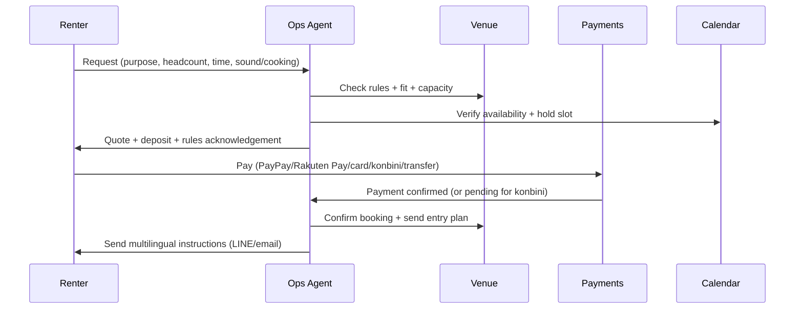
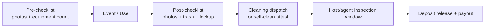
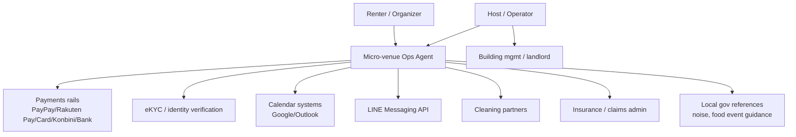

# Micro‑Venue Operations Agent in Japan  
*A Japan‑focused deep‑dive and actionable brief for building an agentic layer that automates host and renter operations for time‑rented venues (Tokyo pilot). Current date: 2026‑02‑23 (Asia/Tokyo).*

## Executive summary

Japan’s micro‑venue ecosystem (rental spaces, pop‑up venues, time‑shared restaurants/bars, studios, meeting rooms, small event spaces) already has **large, liquid supply** on major platforms, but the operational “last mile” remains fragmented and labor‑intensive. On the supply side, **SpaceMarket and Instabase each report 30,000+ listed spaces nationwide** via company PR releases. citeturn6view1turn6view0 In Tokyo specifically, Instabase’s Tokyo listings page currently shows **16,532 search results**. citeturn8view0 SpaceMarket’s Tokyo space listing page provides municipality counts (e.g., Minato‑ku 1,614; Shinjuku‑ku 1,603; Shibuya‑ku 1,449, etc.). Summing those municipality counts yields an estimated **~12,493 Tokyo listings** (derived calculation from the page’s municipality counts). citeturn7view0

On the demand side, the market increasingly includes not just Japanese renters but also **inbound visitors**—Japan’s inbound visitors reached **36,869,900 in 2024** (JNTO), which raises the importance of multilingual messaging, rules comprehension, ID verification, and dispute handling. citeturn23search0 Separately, Tokyo’s business base relevant to micro‑venues is enormous: Tokyo’s Economic Census tables show **76,127** establishments and **735,786** employees in “Accommodation and Food Services,” and **64,271** establishments in “Real Estate and Goods Rental and Leasing.” citeturn14view1turn14view0 This is a large pool of potential hosts, operators, and adjacent service providers (cleaning, facilities).

The opportunity for a **Micro‑venue Operations Agent** is to sit above (or alongside) existing listing marketplaces and provide an agentic “ops OS” that automates: calendar integrity, qualification and rules enforcement, deposits and invoice‑quality receipts (Invoice System compliance), cleaning orchestration, conflict/noise controls, check‑in/out verification, incident handling, and payouts—while remaining compliant with Japan’s data protection law (APPI), landlord/sublease constraints (Civil Code), fire safety duties, and local ordinances. Key regulatory anchors include:  
- **Civil Code Article 612**: lessee may not sublease without lessor approval; violation allows lessor to cancel. citeturn16view1  
- **Tokyo Fire Department guidance**: fire prevention manager appointment obligations depend on building use and occupancy (e.g., “specific use” buildings with capacity ≥30). citeturn1search3  
- **Noise rules**: ward guidance references Tokyo’s environmental ordinance (Article 136) and provides time‑band noise limits. citeturn12view3  
- **APPI (Act on the Protection of Personal Information)**: defines personal information and imposes obligations on handlers; especially relevant for ID docs, chat logs, and incident photos/videos. citeturn15view1  
- **Invoice System**: started **Oct 1, 2023** (NTA), affecting invoicing/receipts for business renters and corporate hosts. citeturn21search0  
- **Event food provisioning**: if a venue hosts temporary food provision, procedures may require permits/notifications depending on the event, purpose, and duration (example: Ota City). citeturn2search3  

A practical Tokyo pilot can be executed in **8–12 weeks** by launching a “host copilot + workflow engine” focused on a narrow set of venues (e.g., 50–150 hosts) that already rent on marketplaces but struggle with operations. The MVP should emphasize **rules + auditability + controlled actions** (payments, notifications, checklists) and protect against agentic risks such as prompt injection and unsafe tool actions (OWASP guidance). citeturn21search2

## Market context and supply anchors in Japan and Tokyo

### Platform supply and pricing anchors

Japan’s micro‑venue supply is already visible, large, and segmented:

SpaceMarket publicly states its platform surpassed **30,000 listed spaces nationwide**, and also cites a third‑party estimate for the “space share market” (スペースシェア市場規模) at **¥379.7B in 2022** and **¥4.8458T by 2032** (estimate quoted in the PR). citeturn6view1  
Instabase (Rebase) also announced its listed spaces surpassed **30,000 nationwide**. citeturn6view0

Tokyo‑specific supply is very large on both major UGC marketplaces:
- **Instabase**: “検索結果 16,532件” on its Tokyo rental space page. citeturn8view0  
- **SpaceMarket**: its Tokyo page lists counts by ward/city (e.g., Minato‑ku 1,614; Shinjuku‑ku 1,603; Shibuya‑ku 1,449; etc.). Summing those municipality counts yields an estimated **~12,493 Tokyo listings** (derived by summation). citeturn7view0  

SpaceMarket also provides a useful price anchor on the Tokyo page: it states that the average hourly price (top 100 spaces, including needed fees) as of **2026‑02‑16** was **¥3,229/hour**. citeturn7view0

Beyond “hourly rental spaces,” commercial pop‑up‑oriented listing supply is also substantial:
- **ShopCounter** states it lets users search and book from **9,500+ spaces nationwide** across **20+ space types** (explicit on its collections page). citeturn12view2  
- **ShareRestaurant** (time‑sharing restaurants/bars) reports **1,000 cumulative openings** and **annual GMV exceeding ¥100M** (PR). citeturn12view0  

### Tokyo business base as a supply multiplier

Tokyo’s statistical base suggests massive “latent supply” for micro‑venues and adjacent services:
- Tokyo Economic Census tables show **76,127** establishments and **735,786** employees in “Accommodation and Food Services” and **64,271** establishments in “Real Estate and Goods Rental and Leasing.” citeturn14view1turn14view0  
These categories contain many potential hosts: restaurants, cafes, bars with off‑hours capacity; property management firms; and small real‑estate operators that can professionalize venue operations.

### Why a new *ops layer* can still win despite large listing platforms

The micro‑venue “inventory problem” is largely solved by aggregates. The remaining value is operational:
- SpaceMarket explicitly notes that cancellation policies vary by space and restrictions (noise, smell, smoking, instruments) are space‑specific and surfaced as “prohibited items.” citeturn7view0  
This heterogeneity creates an execution problem that agentic automation can address: translating messy, space‑specific rules into enforceable checklists and conditional workflows.

## Detailed problem map for hosts and renters in Japan

A Micro‑venue Operations Agent should be designed around the real lifecycle where costs occur. The dominant pain is not “finding a room,” but **coordinating humans, rules, money, and exceptions across one‑off events**.

### Operational pain points by lifecycle stage

| Stage | Host pain points | Renter pain points | Why it matters in Japan |
|---|---|---|---|
| Listing + onboarding | Property rights uncertainty (owner vs lessee vs management); inconsistent rules documentation; pricing strategy | Hard to understand what’s allowed (noise, cooking, filming) | ShopCounter’s listing flow asks whether the property is “self‑owned / rented / managed委託,” reflecting real rights complexity. citeturn9search0 |
| Availability + scheduling | Double‑booking across channels; last‑minute requests; manual confirmations | Waiting for approval; uncertainty about entry instructions | SpaceMarket allows reservations up to **1 hour before start** (last‑minute demand pressure). citeturn7view0 |
| Deposits + payments | Deposit collection/release; payment reconciliation; fraud/chargebacks | Confusing fees; lack of local rails; refund delays | Japan is multi‑rail (QR, card, konbini, transfer). PayPay and Rakuten Pay publish fee structures that hosts care about. citeturn17search2turn18search0 |
| Rules + building constraints | Noise complaints; smoking; trash; parties; equipment misuse | Misunderstanding rules; language barriers | Noise thresholds are regulated at least at ordinance level and applied by time band; enforcement risk is real. citeturn12view3 |
| Check‑in/out + access | Key handoffs; smart locks; late exits; neighbor complaints | Entry friction; “can’t get in” support; address confusion | Inbound visitors increase language + address normalization needs (Japan Post digital address/zipcode APIs help). citeturn17search1turn23search0 |
| Cleaning + reset | Cleaning coordination, supply restock, damage inspection; inconsistent “quality” | Dirty spaces, missing equipment, refund claims | Cleaning is the biggest driver of negative reviews and disputes in many rentals; agent should treat it as a first‑class workflow |
| Incidents + disputes | Damage claims; neighbor complaints; insurance; evidence capture | Refund requests; “not as described”; safety concerns | ShareRestaurant’s insurance program shows how platforms carve out covered vs excluded properties (e.g., excludes spaces with residential portions). citeturn12view1 |
| Tax + invoicing | Invoicing for businesses; “invoice system compatible” status; receipts | Corporate renters need compliant invoices, expense processing | Japan’s Invoice System began **Oct 1, 2023** and impacts who can issue “qualified invoices.” citeturn21search0 |

### Inbound guest friction is increasing

Inbound arrivals reached **36.87M in 2024** (JNTO). citeturn23search0 Even when micro‑venue bookings are made by locals, participants can include non‑Japanese attendees. This adds recurring issues: multilingual entry instructions, translated “house rules,” emergency messaging, and real‑time support channels better than email.

## Regulatory and landlord constraints in Japan

This section summarizes key rules that should be encoded into product decisions and agentic “gates.” It is not legal advice; it is a product‑relevant map supported by primary sources.

### Lease and sublease constraints

Japan’s Civil Code is a foundational constraint for any micro‑venue operation that involves subletting:

- **Civil Code Article 612**: a lessee may not assign the lease or sublease without obtaining the lessor’s approval; if violated, the lessor may cancel the contract. citeturn16view1  
This is why many “rental space hosts” must prove they have either ownership, lessor permission, or a management mandate.

- **Security deposits**: Civil Code Article 622‑2 defines a security deposit as money delivered to secure payment obligations and requires the lessor to return the remaining amount after deducting owed amounts upon termination/return conditions. citeturn16view3  
For an ops agent, this maps cleanly to product logic: deposit ledger, documented deductions, and time‑bound release rules.

MLIT’s “Standard Rental Housing Contract” is a model contract intended to prevent disputes and stabilize landlord–tenant relationships; it is not legally mandatory but is promoted for broader adoption. citeturn6view4 This implies a reality: real lease clauses vary widely, and an ops agent must treat “sublet permission evidence” as a required onboarding artifact for certain host types.

### Fire safety and occupant management

For micro‑venues that host “unspecified many” users, fire safety obligations can shift from a private room to an “assembly” risk profile.

Tokyo Fire Department guidance states that buildings that require fire prevention managers must have appointments by the building owner and **all tenants**, and the obligation depends on building use and occupancy thresholds—e.g., buildings with “specified uses” (theaters, restaurants, shops, hotels, hospitals, etc.) with overall occupant capacity **≥30** require this (with exclusions and detailed categories). citeturn1search3  

Product implication: the agent should maintain a “fire safety capability profile” per venue (max capacity policy, evacuation plan posted, signage, and whether the host has the necessary fire prevention management structure) and block bookings that exceed capacity or violate declared use.

### Building Standards Act and change‑of‑use reality

Micro‑venue businesses often convert existing buildings/units into “rental spaces,” and use changes can trigger compliance checks.

MLIT’s guideline on existing building “current condition surveys” explicitly frames that when performing extensions/renovations or **use changes**, compliance with “building‑related regulations” can apply not only to modified portions but also to existing portions, and it lists the scope of regulations relevant to these surveys, including the Building Standards Act and also **Fire Service Act** among the covered regulatory set. citeturn22search0  

Product implication: onboarding must collect (or require the host to attest to) whether the space is a lawful use for the intended booking types, and include a risk‑graded “needs confirmation” path when usage is ambiguous (e.g., large events, commercial cooking, ticketed events).

### Noise regulation and local ordinances

Noise is not just “house rules”; it can be regulated via ordinances and laws. Minato City’s environmental guidance references Tokyo’s ordinance (“条例第136条関係”) and provides time‑band limits (example: boundary noise values such as 45 dB for 08:00–19:00 in some zone categories; and late‑night periods). It also references the **Noise Regulation Law** (騒音規制法) Article 17 for road traffic noise requests/limits. citeturn12view3  

Product implication: “noise‑allowed” is not binary. The agent needs structured fields: zone type (where known), allowed hours for sound, instrument permission, amplification permission, and neighbor proximity. It should automatically generate renter “quiet mode” reminders during restricted periods.

### Data protection under APPI and PPC oversight

The Act on the Protection of Personal Information (APPI) defines “personal information” and establishes obligations for businesses handling personal information, including purpose specification and other duties. citeturn15view1  

For a micro‑venue ops agent, high‑risk personal data includes: ID documents (eKYC), access logs, geo/time traces, incident photos/videos, and chat transcripts. The product must implement purpose limitation, retention limits, access controls, and incident response playbooks.

### Municipal event and food permits

If micro‑venues host events that include public food provision, local rules apply. Ota City’s guidance states that providing food at events in simple facilities may require **business permits or notifications**, and that required procedures differ based on event type, purpose, and duration—requiring advance consultation with the responsible department. citeturn2search3  

Product implication: the ops agent should have a “food‑in‑event” toggle that triggers a compliance flow: questions, recommended consultation, and stored evidence of permit/notification where applicable.

### “No lodging unless authorized” constraint

Micro‑venues often get wrongly used as short‑term lodging. Japan’s official “minpaku” portal explains the legal framework around the Residential Accommodation Business Act (民泊新法) and positions it as the official government site for the制度. citeturn22search2  

Product implication: the agent should explicit‑policy block “overnight lodging” use cases unless the venue is registered/authorized for that purpose.

## Prioritized agentic automation features

### Feature prioritization logic

The ops agent should start with features that reduce support load and disputes fastest:
- **Calendar coherence + confirm latency reduction**
- **Deposit and refund automation**
- **Cleaning orchestration + quality proof**
- **Rules enforcement + incident evidence**
- **Invoice/receipt compliance for business renters**

Below is the requested feature set with operational details: inputs, outputs, decision rules, failure modes, and HITL gates.

### Features mapped to friction types

| Feature module | Matching | Scheduling | Trust/ID | Payments | QC | Disputes | Compliance/regulatory | Pricing/capacity |
|---|---:|---:|---:|---:|---:|---:|---:|---:|
| Matching + qualification agent | ✓ | ◐ | ✓ |  | ◐ |  | ◐ | ◐ |
| Capacity & scheduling agent | ◐ | ✓ |  |  |  | ◐ |  | ✓ |
| Trust/identity & eKYC agent | ◐ |  | ✓ | ◐ |  | ✓ | ◐ |  |
| Payments & escrow/deposit agent |  | ✓ | ◐ | ✓ |  | ✓ | ◐ | ◐ |
| Pre/post checklist (ops) agent |  | ✓ | ◐ |  | ✓ | ✓ | ◐ |  |
| Dynamic pricing agent | ◐ | ✓ |  |  |  |  |  | ✓ |
| Dispute‑resolution agent |  |  | ◐ | ✓ | ✓ | ✓ | ◐ |  |
| Insurance/claims agent |  |  | ✓ | ✓ | ✓ | ✓ | ✓ |  |

### Detailed specification by feature

#### Matching and qualification agent

**Goal:** Reduce “bad bookings” (noise complaints, wrong use type, capacity mismatch) and reduce host back‑and‑forth.

Inputs include: renter intent (party/meeting/filming/commercial pop‑up), expected headcount, time band, alcohol/cooking/sound needs, language preference; venue constraints (prohibited items, max capacity, quiet hours, cooking allowed). SpaceMarket explicitly frames that prohibited items and restrictions vary by space, which motivates a structured qualification layer. citeturn7view0  

Outputs: recommended venues; a “fit score”; a pre‑filled rules acknowledgment; an “if/then” requirement list (e.g., additional deposit for high‑risk uses).

Decision rules:  
- Hard blocks: exceed capacity; use types explicitly prohibited; late‑night sound in zones where not allowed. Fire‑safety capacity and management requirements can be relevant for higher‑occupancy venues. citeturn1search3turn22search0  
- Soft blocks: first‑time renters requesting high‑risk use (party + cooking + sound), route to approval.

Failure modes:  
- Misclassification of intent leading to mismatch and disputes.  
- Renters downplaying use to get approved.

HITL gates:  
- New renter + high risk booking (party, >X people, cooking, amplified sound).  
- Any booking that touches regulated activities (food sale, street use) → compliance checklist and review. citeturn2search3turn22search3  

#### Capacity and scheduling agent

**Goal:** Eliminate double‑booking and reduce time‑to‑confirm.

Inputs: availability calendars across channels; buffer policies; cleaning schedule; “instant booking” eligibility. SpaceMarket states bookings can be made up to 1 hour before use. citeturn7view0  

Outputs: confirmed slots; automated buffer insertion; “hold” objects for pending payment; calendar sync updates.

Decision rules:  
- Enforce “cleanup buffer” dependent on booking type.  
- Disallow overlapping holds; release holds after payment timeout.  
- For last‑minute bookings, restrict to venues with self check‑in and validated readiness.

Failure modes:  
- Calendar sync failures cause phantom availability.  
- Cleaning not confirmed → dirty space.

HITL gates:  
- Any booking that requires a cleaner dispatch without confirmed coverage.

#### Trust/identity & eKYC agent

**Goal:** Reduce fraud, damage, chargebacks; improve deposit compliance.

Inputs: renter identity docs; phone/email; payment instrument; risk signals; optionally business registration for corporate renters. Japan’s online identity verification norms are shaped by official frameworks; FSA Q&A describes online identity verification method context (non‑face‑to‑face verification). citeturn17search2turn18search0turn17search2  

Outputs: verification tier; allowed booking limits; deposit multipliers.

Decision rules:  
- Tiered verification:  
  - Tier 0: email/phone only (low‑risk uses)  
  - Tier 1: card verification + selfie/ID check (medium risk)  
  - Tier 2: stronger checks for high‑risk uses or high GMV.

Failure modes:  
- APPI risk if data collected without clear purpose and retention controls. citeturn15view1  
- False positives locking out legitimate renters; false negatives enabling fraud.

HITL gates:  
- Any automated “deny” based on risk score should be reviewable with appeal.

#### Payments and escrow/deposit agent

**Goal:** Automate collection/release of deposits, handle refunds, support Japan‑native rails.

Japan payment rails and fee structures matter to hosts:
- PayPay publishes merchant fees: 1.60% under specific plan conditions vs 1.98% otherwise (tax excluded), plus other service fees. citeturn17search2  
- Rakuten Pay announced 2.20% vs 2.48% plans (with conditions), and highlights broad brand coverage. citeturn18search0  
- Konbini payments are a culturally important method; Stripe’s documentation describes code‑based convenience store cash payment flow. citeturn18search2  

Inputs: booking amount, deposit policy, cancellation policy, tax classification, invoice requirements.

Outputs: payment schedule; deposit ledger; refund events; receipts/invoices.

Decision rules:  
- Deposit release rule based on post‑event checklist completion + no incident window.  
- Cancellation rule according to venue policy; SpaceMarket notes cancellation rules vary per space. citeturn7view0  
- Invoice behavior: if “invoice system compliant” required, require host’s registered invoice issuer number; NTA explains invoice system started Oct 1, 2023 and registered issuers can issue qualified invoices. citeturn21search0  

Failure modes:  
- Payment rail limitations (konbini settlement lag) causing delayed confirmation.  
- Chargebacks and disputes.

HITL gates:  
- High‑value refunds; chargeback responses; evidence review.

#### Pre/post event checklist agent (ops agent)

**Goal:** Reduce cleaning disputes and damage ambiguity by making “proof” routine.

Inputs: venue‑specific checklist; photos/videos; equipment inventory; trash rules; noise reminders.

Outputs: time‑stamped checklists; exception flags; cleaning dispatch tasks.

Decision rules:  
- Require “pre photos” for high‑risk bookings; require “post photos” always.  
- If post checklist not completed → delay deposit release.

Failure modes:  
- Renters skip steps; photos are insufficient.

HITL gates:  
- Any incident claim triggers human review before charging deposit.

#### Dynamic pricing agent

**Goal:** Increase utilization and reduce idle time by price shaping.

Inputs: historical bookings; day/time measures; nearby competitor rates; lead time; event calendar; cleaning cost.

Outputs: suggested pricing; promos; minimum booking windows; buffer adjustments.

Anchor: SpaceMarket’s Tokyo page provides a current average hourly rate benchmark (¥3,229/hr for top 100 spaces). citeturn7view0  

Decision rules:  
- Don’t underprice below cleaning + support cost floors.  
- Apply surge pricing for high‑demand time bands.

Failure modes:  
- Over‑surge causes demand collapse; underpricing causes damage risk.

HITL gates:  
- First 4 weeks: “suggest only” mode; human approves.

#### Dispute‑resolution agent

**Goal:** Reduce support cost and speed resolution (refunds, damage, noise complaints).

Inputs: chat logs; checklists; photos; neighbor complaints; payment evidence; cancellation terms.

Outputs: recommended resolution; refund amount suggestions; deposit deductions; standardized evidence pack.

Decision rules:  
- Apply consistent policy; require evidence for deductions.  
- If allegation involves safety/fire code exceedance → immediate escalation (Tokyo Fire Department obligations are strict for certain uses). citeturn1search3  

Failure modes:  
- Incorrect resolution increases legal risk, churn.

HITL gates:  
- Any case with injury, police report, or large deduction.

#### Insurance/claims agent

**Goal:** Bundle or streamline liability and property damage coverage.

Inputs: venue type, size, residential portion, intended use, occupancy, policy.

Outputs: coverage option; claim intake; evidence requests; payout workflow.

ShareRestaurant’s insurance page illustrates industry‑style constraints: only contracts created through the service are covered; excludes spaces with residential portions; excludes very large facilities >1,000㎡, etc. citeturn12view1 This demonstrates how insurers and platforms define “insurable scope” tightly.

Failure modes:  
- Coverage mismatch → catastrophic host dissatisfaction.

HITL gates:  
- Any claim over a threshold; any claim that implies regulatory breach.

## Concrete user flows and Mermaid diagrams

### Host onboarding flow

```mermaid
flowchart TD
  H[Host starts onboarding] --> R1[Property rights intake\n(owner / lessee / manager)]
  R1 --> R2[Upload evidence:\nlease clause or owner consent if subletting]
  R2 --> R3[Venue profile:\ncapacity, use types, equipment, quiet hours]
  R3 --> R4[Compliance flags:\nfire safety profile, noise constraints]
  R4 --> R5[Payments setup:\nrail selection + payout bank]
  R5 --> R6[Invoice system fields\n(optional): qualified invoice support]
  R6 --> R7[Calendar sync:\nGoogle/Outlook + internal]
  R7 --> R8[Cleaning SLA setup:\npartner or self-clean]
  R8 --> Live[Go live + agent monitoring]
```

Key constraint: sublease requires lessor approval; violation can permit cancellation under Civil Code Article 612. citeturn16view1

### Renter booking flow



SpaceMarket’s Tokyo page indicates last‑minute bookings (up to 1 hour prior) are possible, increasing the need for reliable self check‑in and readiness automation. citeturn7view0

### Check‑in/out and cleaning flow



### Incident and dispute handling flow

```mermaid
flowchart TD
  I[Incident reported\n(host/renter/neighbor)] --> E[Evidence capture\nphotos, timestamps, chat logs]
  E --> T[Triaging agent\npolicy + severity]
  T -->|Low/med| R[Recommended resolution\nrefund / partial charge]
  T -->|High| H[Human review desk]
  H --> Ins[Insurance claim intake\nif covered]
  H --> Pay[Deposit deduction or refund]
  Pay --> Close[Close + postmortem\nrisk tag updates]
```

### Stakeholder relationships



LINE integration is feasible via the Messaging API documentation. citeturn17search0

## MVP scope and an 8–12 week Tokyo pilot plan

### MVP scope for Tokyo

A Tokyo‑pilot MVP should prioritize: (1) schedule integrity, (2) deposits and evidence, (3) cleaning orchestration, (4) multilingual comms, (5) invoice‑ready receipts.

Minimum shippable modules:
- Unified availability + holds + confirmations (ops‑grade, not just a calendar widget)
- Payments + deposit ledger + refund workflow
- Host rule engine + renter rules acknowledgement
- Pre/post checklist with photo capture
- Incident intake and triage + human desk
- Multilingual templates (JP/EN) for: entry, rules, emergency, checkout
- Host “compliance profile” (sublease evidence, max capacity, noise policy)

### Integration plan (Japan‑specific)

| Integration | Why it matters | Primary source anchor | Pilot approach |
|---|---|---|---|
| PayPay | High adoption; fee clarity needed | PayPay fee schedule shows 1.60% vs 1.98% depending on plan and conditions. citeturn17search2 | Start with card/konbini + bank transfer; add PayPay for cohort of hosts or via aggregator |
| Rakuten Pay | Competitive SME fees; broad brand coverage | Rakuten Pay press release: 2.20% (standard) vs 2.48% (light) plans (conditions apply). citeturn18search0 | Add as optional rail; useful for hosts wanting an all‑in‑one terminal ecosystem |
| Konbini payments | Local preference for cash‑like settlement | Konbini flow described by Stripe docs (code + cash at convenience store). citeturn18search2 | Offer for renters without cards; set booking confirmation rules for “pending” status |
| Bank transfer (furikomi) | Common for businesses and some consumers | (Japan practice; no single standard doc) | Start with manual confirmation for pilot; build automated reconciliation later |
| eKYC provider | Reduces fraud/chargebacks | Use APPI controls; base posture informed by official identity verification norms | Tiered verification; keep strong eKYC only for high‑risk bookings |
| LINE notifications | Default comms channel for many users | LINE Messaging API docs. citeturn17search0 | Send confirmations, entry codes, reminders, and incident escalation via LINE |
| Google/Outlook calendar sync | Prevent double booking | Outlook calendar API overview (non‑Japan). citeturn18search3 | Start with one‑way sync + periodic reconciliation; expand to two‑way |
| Address normalization | Japanese address complexity; inbound users | Japan Post provides postal code data downloads and notes a postal code/digital address API (free from May 2025, supports Kanji/Kana/Roma). citeturn17search1 | Use postal code lookup + canonical address formatting; enforce map‑pin validation |
| Invoice system support | B2B renters need compliant invoices | NTA explains Invoice System started Oct 1, 2023 and registration requirement. citeturn21search0 | Collect host invoice issuer status; generate receipts and invoice‑ready records |

### 8–12 week pilot plan (Tokyo)

A realistic plan assumes you will not replace SpaceMarket/Instabase immediately; you will **select hosts** who have recurring operational burden and run the agent as “ops middleware.”

**Weeks 1–2: Pilot design and host recruitment**  
Recruit 50–150 hosts across 3 clusters: (a) party rooms and small event spaces, (b) studios/salons that care about clean resets, (c) off‑hours commercial spaces (cafes/bars) that need rule enforcement. Use Instabase/SpaceMarket density anchors to justify supply availability. citeturn8view0turn7view0  

**Weeks 3–4: Build core workflow engine and admin**  
Ship: booking holds, payment intent creation, deposit ledger, basic rules engine, host dashboard, audit logs.

**Weeks 5–6: Checklist + cleaning and comms automation**  
Integrate photo checklists, cleaning partner dispatch (API or email‑to‑ticket), LINE messaging. citeturn17search0

**Weeks 7–8: Launch “concierge + HITL” mode**  
Operate with human oversight for: high‑risk bookings, refunds/chargebacks, incidents. Enforce sublease evidence in onboarding and block unverified “rented but no consent” hosts. citeturn16view1

**Weeks 9–10: Optimize conversion + reduce support load**  
A/B test: required deposit thresholds, instant booking eligibility, reminder cadence, multilingual instruction templates (JP/EN).

**Weeks 11–12: Expand rails + pricing experiments**  
Add one Japan‑native QR rail (PayPay or Rakuten Pay) for a subset. Use published fee rates to model take‑rate sustainability. citeturn17search2turn18search0

Team composition (lean but credible): product lead, full‑stack engineer, backend/workflow engineer, agent engineer (LLM + rules), ops lead (host success + disputes), part‑time privacy/legal lead (APPI + contracts). APPI compliance is a core pilot requirement due to ID, chat logs, and incident photos. citeturn15view1

## KPIs and dashboards to track

A micro‑venue ops agent should track KPIs that measure reduced transaction costs and lowered exception rates.

Core funnel and speed:
- **Time‑to‑confirm**: median minutes from request → confirmed booking  
- **Booking conversion**: confirmed bookings / booking intents  
- **Drop‑off reasons**: payment pending (konbini lag), rules refusal, scheduling conflicts

Utilization and quality:
- **Utilization**: booked hours / available hours  
- **Cleaning compliance rate**: % bookings with completed post‑checklist + cleaning confirmation  
- **Quality incident rate**: (dirty/equipment missing) incidents per 1,000 bookings

Financial:
- **GMV** (gross booking value), weekly and monthly  
- **Take rate realized**: platform revenue / GMV  
- **Deposit recovery rate**: (deductions collected) / (approved deductions)  
- **Refund rate**: refunded GMV / GMV

Risk:
- **Dispute rate**: disputes per 1,000 bookings  
- **Chargeback rate** (where applicable)  
- **Noise complaints per 1,000 bookings** (especially in wards with stricter local enforcement signals) citeturn12view3  

Compliance:
- **Invoice compliance coverage**: % B2B bookings with invoice‑ready receipt; track linkage to NTA invoice system rules. citeturn21search0  
- **Sublease evidence coverage**: % hosts with verified lessor consent per Civil Code Article 612 expectations. citeturn16view1  

## TAM/SAM/SOM for Tokyo micro‑venue ops

This sizing is intentionally transparent and sensitivity‑based. It is not an official statistic; it is a planning model anchored to platform supply counts and observed pricing.

### Supply anchors used

- Instabase Tokyo listings: **16,532** results. citeturn8view0  
- SpaceMarket Tokyo listings: municipality counts sum to **~12,493** listings (derived). citeturn7view0  
- SpaceMarket Tokyo price anchor: average hourly value (top 100) **¥3,229/hr** as of 2026‑02‑16. citeturn7view0  

Because platforms overlap, do **not** add these counts. The model uses a **unique‑venue estimate** range.

### Assumptions

Define:
- **V** = unique micro‑venues addressable in Tokyo (range)  
- **B** = bookings per venue per month (range)  
- **AOV** = average booking value (range)  
- **TR** = effective take rate (platform revenue / GMV)

AOV anchor logic: SpaceMarket provides an average hourly price benchmark; typical bookings are often multi‑hour. The model uses booking‑value ranges consistent with 2–4 hour sessions plus fees. citeturn7view0  

### Tokyo GMV and revenue estimates

| Scenario | Unique venues V | Bookings/venue/month B | Avg booking value AOV | Annual GMV (Tokyo) | Revenue @ 8% TR | Revenue @ 12% TR |
|---|---:|---:|---:|---:|---:|---:|
| Low | 15,000 | 3 | ¥8,000 | ¥4.32B | ¥346M | ¥518M |
| Base | 20,000 | 6 | ¥12,000 | ¥17.28B | ¥1.38B | ¥2.07B |
| High | 25,000 | 10 | ¥18,000 | ¥54.0B | ¥4.32B | ¥6.48B |

Interpretation: even modest take rates can sustain a strong business if the agent reduces disputes/support and lifts utilization. However, note that an older METI sharing‑economy survey (2018 reference year) reported very small “place share (excluding minpaku)” transaction totals (¥105M) in its defined scope—likely because of measurement scope limitations and the market’s later growth. citeturn20view0 The platform‑supply and pricing anchors in 2023–2026 strongly suggest the market is materially larger now. citeturn6view1turn8view0turn7view0

### SAM and SOM framing for a Tokyo pilot

A credible SAM for a 24‑month scope is not “Tokyo GMV,” but “GMV routed through signed hosts + integrated rails.”

Example operational SAM (base):  
- 1,000 hosts onboarded × 6 bookings/month × ¥12,000 × 12 = **¥864M GMV/year**  
- At 10% take rate average (or hybrid SaaS+fees), **~¥86M/year** revenue

SOM (3–5 years) depends primarily on host acquisition and repeat usage; targeting “multi‑use party rooms + studios” first typically yields higher booking frequency than rare commercial pop‑ups.

## Go‑to‑market tactics and partner outreach templates

### Positioning: “Ops OS” rather than “another listing site”

Because SpaceMarket/Instabase already supply inventory, launch as:
- A **host operations layer**: “reduce disputes, automate cleaning, handle deposits, make invoices easy.”
- An **enterprise‑lite tool** for small operators: “calendar coherence + payouts + checklists + evidence.”

### Target partner types in Tokyo

- “Top‑reviewed” hosts with high utilization but high support load (fast ROI)
- Multi‑room operators (they feel scheduling pain most)
- Property managers who manage multiple units (they can roll out policy and compliance)
- Cleaning services that already serve short‑stay or rental‑space operators

### Outreach email templates

**Host outreach (individual operator)**  
```text
Subject: Reduce disputes & cleaning chaos for your rental space (Tokyo pilot)

Hi <Name>,

I’m building a “micro‑venue operations agent” that automates:
- calendar holds + confirmations (prevents double‑booking)
- deposits + automated release (with photo evidence)
- pre/post checklists + cleaning dispatch
- multilingual entry/rules messages via LINE
- invoice‑ready receipts for business renters

We’re running a small Tokyo pilot (8–12 weeks). It’s designed to sit on top of your current channels.
Would you be open to a 20‑minute call to see if this can cut your support load and improve utilization?

Best,
<Name>
```

**Property manager / multi‑unit operator outreach**  
```text
Subject: Workflow automation for 10+ rental spaces (Tokyo) — deposit, cleaning, disputes

Hi <Name>,

We’re piloting an ops layer for multi‑unit rental‑space operators:
- unified availability + buffer rules
- deposits/refunds with audit trails
- cleaning SLAs and inspection windows
- incident workflows + optional insurance routing
- APPI‑aware handling of IDs and incident evidence

Can we discuss a pilot for <#> units in Tokyo? We can start with “assistive mode”
(human approvals on high‑risk actions) to reduce operational risk.
```

### Partnership terms and host onboarding checklist

A practical pilot agreement should define:
- Revenue model: take‑rate on GMV and/or monthly SaaS fee
- Deposit policy: who sets it; when released; evidence requirements
- Cleaning responsibility: host vs platform vs partner
- Incident responsibilities: response SLAs and escalation
- Data processing terms (APPI): purposes and retention

**Host onboarding checklist (minimum):**
- Property rights status (owner/lessee/manager) + evidence of subletting permission where needed (Civil Code risk). citeturn16view1  
- Max occupancy and allowed use types (fire safety relevance). citeturn1search3  
- Noise policy and quiet hours; location zone notes where available (ward ordinance reference). citeturn12view3  
- Entry method (self check‑in vs staff), emergency contacts
- Cleaning SLA and partner contact
- Payment rail preference
- Invoice/receipt needs (Invoice System) citeturn21search0  

## Risks, mitigations, and a legal/compliance checklist for pilots

### Core risks

APPI/privacy risk: identity documents, incident photos, and chat logs are sensitive personal information; mishandling or unclear purpose increases legal and reputational risk. citeturn15view1  

Landlord/building rule blowback: hosts who sublet without approval can lose contracts; Civil Code explicitly restricts subleasing without lessor approval and allows cancellation. citeturn16view1  

Fire safety and capacity risk: for certain building uses and occupancy thresholds, Tokyo Fire Department indicates fire prevention management roles are required; exceeding capacity creates serious liability. citeturn1search3  

Noise complaints and enforcement: local guidance references Tokyo ordinance frameworks and defines time‑band noise regulation expectations. citeturn12view3  

Insurance gaps: mismatch between “what happened” and “what’s covered.” ShareRestaurant’s insurance page demonstrates how platforms carve out excluded property types (residential portions, very large facilities) and scope coverage only to on‑platform contracts. citeturn12view1  

Agent safety risk (prompt injection / unsafe tool actions): if the agent reads renter messages and then executes actions (refunds, calendar edits, payouts), it can be manipulated. OWASP defines prompt injection as inputs altering model behavior in unintended ways. citeturn21search2  

### Mitigations that should be built into the MVP

A defensible pilot posture includes:
- **Human‑in‑the‑loop gates** for any irreversible action: refunds over threshold, deposit deductions, account bans, insurance claims submissions.
- **Least‑privilege tool access**: separate tokens per workflow; no “god mode” API keys in an agent runtime.
- **Deterministic policy engine**: rules and monetary calculations must be deterministic, not LLM‑generated.
- **Evidence‑first operations**: photo checklists as default; no deposit deductions without evidence pack.
- **Scope and use enforcement**: explicit block on lodging‑like use unless authorized (minpaku context). citeturn22search2  
- **Data minimization and retention controls** aligned to APPI: collect only what’s needed; purge ID artifacts after verification windows; restrict employee access. citeturn15view1  

### Legal/compliance checklist for Tokyo pilot

This is a practical checklist to review with counsel:

- Contract structure:
  - Host agreement: roles, deposit policy, incident handling, indemnities, fee schedule
  - Renter TOS: rules acknowledgement; liability; refund terms; prohibited uses  
- Sublease and property rights:
  - Collect evidence of lessor approval if host is a lessee (Civil Code 612 risk). citeturn16view1  
- Fire safety and occupancy:
  - Collect max capacity; require host attestation of compliance; provide booking caps
  - Escalate venues that may require fire prevention manager structures. citeturn1search3turn22search0  
- Noise:
  - Encode quiet hours; default reminders; enforce “no amplification” in sensitive increases; reference ward ordinance context. citeturn12view3  
- Food/events:
  - If food provision or sales occur, trigger compliance checklist and municipality consultation workflow (Ota City example). citeturn2search3  
- APPI:
  - Data inventory (IDs, chats, photos); purpose specification; retention schedule; incident response; vendor DPAs. citeturn15view1  
- Invoicing:
  - Invoice System logic for qualified invoices and issuer registration status for hosts who need B2B invoices. citeturn21search0  

```text
Key reference links (for internal pilot docs)
- Instabase Tokyo listing count: https://www.instabase.jp/tokyo-rentalspace
- SpaceMarket Tokyo listing page: https://www.spacemarket.com/lists/rwe5ymkuatt1gurjxzabn3ga/
- APPI (official translation): https://www.japaneselawtranslation.go.jp/en/laws/view/4241
- Civil Code (Article 612): https://www.japaneselawtranslation.go.jp/en/laws/view/3494/en
- Tokyo Fire Department (fire prevention manager): https://www.tfd.metro.tokyo.lg.jp/lfe/office_adv/jissen/p04.html
- NTA invoice system: https://www.nta.go.jp/taxes/shiraberu/taxanswer/shohi/6498.htm
- PayPay merchant fees: https://paypay.ne.jp/help-merchant/b0544/
- Rakuten Pay fee plan release: https://payment.rakuten.co.jp/news/2024120200/
- Japan Post zipcode & digital address API: https://www.post.japanpost.jp/zipcode/download.html
- LINE Messaging API docs: https://developers.line.biz/en/docs/messaging-api/
```

