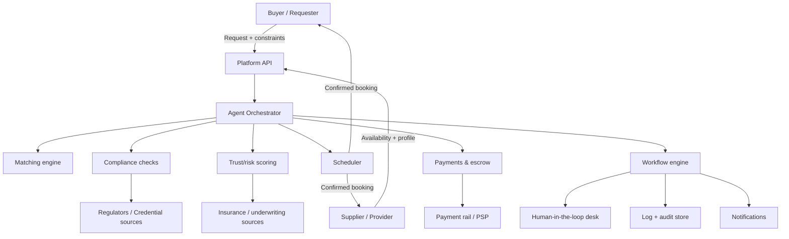
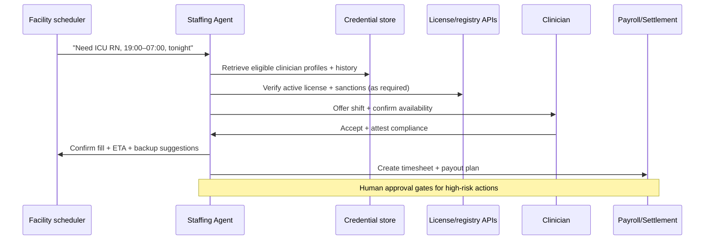

# Agentic Services Opportunities in Supplier–Demand Markets

## Executive summary

Supplier–demand “friction” is best understood as the *transaction cost bundle* that prevents two parties who could beneficially exchange from doing so efficiently—search, coordination, verification, compliance, settlement, and exception handling—rather than the core production work itself. Classic transaction-cost economics frames this as the cost of using the market (searching, bargaining, contracting, enforcing), explaining why organizations internalize exchanges when those costs rise. citeturn23search0turn23search5 Two-sided market theory adds that platforms can reduce these costs and optimize pricing/participation across both sides. citeturn23search2turn23search6 Empirical platform research further shows that “market design” choices (e.g., availability tracking, ranking, reducing rejection) can materially change conversion and matching efficiency. citeturn39view0

“Agentic services” are a step-change beyond forms + workflows: they combine (a) tool-using AI that can plan and execute multi-step tasks while monitoring state and recovering from errors and (b) durable orchestration to ensure actions happen exactly as intended (or escalate). Research on reasoning+acting methods (tool use and action planning) supports this paradigm. citeturn20search0turn20search1 However, agentic systems introduce new operational and security risks (notably prompt injection) that require defense-in-depth and human-in-the-loop controls. citeturn37view0turn33view1

Across verticals, the highest ROI for agentic automation tends to occur where (i) capacity is perishable (time slots, shifts, vehicles, rooms), (ii) compliance and trust gating are heavy (licenses, identity, insurance), and (iii) exceptions are frequent (cancellations, no-shows, disputes). Using a transparent scoring model (weighted by friction severity, market size, regulatory complexity, and technical feasibility), the strongest early opportunities cluster in: healthcare staffing & credentialing; insurance claims & repair coordination; last-mile logistics & dispatch; construction trades & permitting; and B2B equipment rental & asset sharing. Real-world evidence supports that automating “edge-to-edge” operations can yield large gains: DoorDash reports measurable dispatch efficiency improvements from ML/RL approaches, and Lemonade reports high automation rates in claims intake and a material share of automated claims decisions. citeturn3view0turn30view1turn5view0

Financial sizing (with explicit assumptions) suggests that even modest “software-equivalent take rates” or savings-share pricing on large transaction pools can create large revenue TAMs. For example, DoorDash alone reported 2024 Marketplace GOV of about $80.2B and 2.6B total orders, while Uber reported 2024 gross bookings of about $162.8B—illustrating the scale of dispatchable, measurable, and optimizable demand. citeturn30view1turn32view0 In insurance, a McKinsey report states personal P&C premiums were about $1.1T in 2023 and about a quarter of total insurance premiums, implying a multi-trillion premium base in scope for claims-related servicing value pools. citeturn17view0

## Supplier–demand frictions taxonomy

### Working definition

A supplier–demand friction is any *avoidable cost, delay, uncertainty, or risk* incurred to complete an exchange (or decide not to), including: discovering counterparties, confirming fit, coordinating time/capacity, meeting regulatory requirements, transacting payment, fulfilling delivery, and resolving exceptions/disputes.

This aligns with the transaction-cost lens: markets require search and contracting costs; firms exist partly to reduce these costs when market exchange becomes expensive. citeturn23search0turn23search5 Digital platforms can reduce (or sometimes shift) these costs by mediating search, monitoring availability, and shaping incentives. citeturn23search2turn39view0

### Friction taxonomy and measurable symptoms

A practical taxonomy for product design is to classify frictions by where automation can intervene:

| Friction type | What it looks like in practice | What to measure |
|---|---|---|
| Matching and qualification | Buyer can’t find the right supplier; supplier can’t find the right job; poor fit leads to churn | time-to-match, qualification rate, lead-to-booking conversion, match quality score |
| Scheduling and capacity | Perishable slots (shifts, rooms, delivery windows) go unused; double-bookings; last‑minute cancellations | utilization %, fill rate, cancellation/no‑show rate, reschedule rate, lead time |
| Onboarding and activation | Suppliers stall at identity/KYC, credential upload, training; buyers stall at intake/config | onboarding completion %, time-to-first-transaction, dropout reasons |
| Compliance and regulatory approvals | Licenses, permits, food/health/safety rules, documentation, audits | “time-to-compliant,” rejection rate, audit finding rate, compliance SLA %
| Trust, identity, and fraud | Counterparty uncertainty; fake credentials; chargebacks; safety incidents | fraud rate, chargeback rate, dispute rate, incident rate |
| Payments and settlement | Multi-party flows, withholding/taxes, refunds, cross-border complexity | payout latency, reconciliation exceptions, refund cycle time |
| Logistics and coordination | Routing, pickup/delivery, handoffs, returns | on-time %, cost per job, miles/tasks per hour |
| Forecasting and dynamic pricing | Supply and demand mismatch; wrong staffing; idle capacity | forecast error, incentive spend per incremental unit, price elasticity proxy |
| Quality control | Work quality varies; outcomes hard to verify | QA pass rate, rework %, complaint rate |
| Dispute resolution | Complaints, refunds, insurance claims; high support burden | time-to-resolution, repeat contact rate, cost-to-serve |

Empirical platform work highlights that even “simple” design features (availability tracking, ranking that considers acceptance) can meaningfully change acceptance and rejection dynamics—i.e., reduce an important transaction cost (rejection) and increase bookings. citeturn39view0

## Priority verticals for agentic automation

### Prioritization method

The opportunity ranking in the chart above is based on an explicit weighted score:

- Friction severity (35%): how much time/money is wasted in coordination and exceptions.
- Market size (25%): size of transaction pool (GMV/spend/premiums) and repeat frequency.
- Regulatory complexity (20%): degree to which “compliance automation” is valuable and defensible (but also riskier).
- Technical feasibility (20%): digitization readiness, data availability, workflow standardization.

This is complementary to economic theory: platforms win when they measurably lower transaction costs and improve allocation efficiency. citeturn23search2turn39view0

### Ranked verticals and why they score well

The table below summarizes the most relevant verticals (including examples from the user’s prompt). Market-size anchors are drawn from primary filings and major reports where available; several scores remain expert estimates and should be validated in pilots.

| Vertical | Core suppliers ↔ demand | Why friction is severe | Regulatory complexity hotspots | Evidence of scale / anchors | Practical note |
|---|---|---|---|---|---|
| Healthcare staffing & credentialing | clinicians/caregivers ↔ hospitals/clinics/home-care orgs | perishable shifts, credential checks, high exception rate, shortage pressure | privacy rules (PHI), licensure verification, labor rules | WHO cites potential global shortage of ~10M health workers by 2030, pressuring staffing systems. citeturn18search5 | High ROI but requires tight compliance + integrations |
| Insurance claims & repair coordination | policyholders/repair vendors ↔ insurers/TPAs | heavy documentation, fraud controls, multi-party coordination, disputes | privacy, financial controls, claims handling rules | Lemonade reports 96% of FNOL handled by AI without human intervention and 55% of claims “fully automated” (company-reported). citeturn5view0 | Great agentic fit: document+workflow+exception handling |
| Last-mile logistics & dispatch | couriers/drivers/fleets ↔ consumers/merchants | routing, real-time dispatch, incentives, cancellations, service-level SLAs | worker classification, insurance, local transport rules | DoorDash 2024: 2.6B total orders and ~$80.2B Marketplace GOV (10‑K). citeturn30view1 | Data-rich; fast iteration; strong ROI proof from incumbents |
| Construction trades & permitting | independent trades ↔ homeowners/GCs/property managers | scheduling across many dependencies; rework; permits/inspections | permitting workflows, local codes, contractor licensing | Global construction is ~US$13T (2023) per McKinsey. citeturn6search6 | ROI is huge but enterprise sales + fragmented tooling |
| B2B equipment rental & asset sharing | equipment owners ↔ contractors/events/SMBs | availability, logistics, damage risk, deposits, insurance | equipment safety, insurance, contract terms | ARA-cited US equipment rental industry figure reported as ~$83.3B (2024). citeturn6search13 | “Insurtech + scheduling + logistics” bundling is a wedge |
| Manufacturing subcontracting | job shops ↔ OEMs/procurement | RFQs, lead times, QA, compliance, change orders | quality/certifications, export controls in some niches | Large addressable pool but integration/standardization is hard (expert view) | Often better as “agentic procurement copilot” than full marketplace |
| Event venues & ticketed experiences | venues/spaces ↔ creators/attendees | calendar availability, deposits, local rules, disputes | safety limits, liquor/food permits (when relevant) | Eventbrite reports (2024) distributing 83M paid tickets across 4.7M events. citeturn24search2 | Great for scheduling + payments + dispute automation |
| Food & commercial kitchens | kitchens/venues ↔ chefs/brands | kitchen-hour availability + compliance + inspections | food safety and licensing | Pattern mirrors the Tokyo kitchen/chef problem (related) | Compliance is the key moat |
| Beauty & wellness | stylists/clinics ↔ consumers | scheduling/no‑shows dominate | light unless medical | High feasibility but crowded; defensibility weaker | Best as “agentic retention + capacity” add-on |

### What “high ROI” means operationally in these verticals

A useful mental model is: **Agentic automation is most valuable when it converts “manual coordination hours” into “machine-executed actions” while reducing exception costs**. In last-mile, small improvements in dispatch or driver efficiency are measurable and compounding; DoorDash’s dispatch research reports a 6‑second improvement in delivery speed and 1.5‑second improvement in Dasher efficiency in a production RL framework context (as presented in an NVIDIA/Doordash GTC talk). citeturn3view0 In insurance, high automation in FNOL and claims decisions can reduce loss adjustment expense and cycle time; Lemonade explicitly frames “AI Jim” as handling FNOL with “zero claims overhead” in the cited metric. citeturn5view0

## Agentic service patterns and user flows

### Core agentic patterns

Agentic services can be decomposed into a small number of reusable patterns. Research on tool-using LLM strategies supports the idea that models can interleave reasoning and actions (tool calls) for better performance and interpretability. citeturn20search0turn20search1 In production, these patterns generally require *workflow durability* (retries, compensation, auditing), not just “chat.” Temporal’s workflow documentation emphasizes reliability/durability considerations such as deterministic workflows and versioning. citeturn21search2

#### Pattern-to-friction mapping table

Legend: ✓ = primary fit, ◐ = secondary fit

| Agentic pattern | Matching | Scheduling | Compliance | Trust | Payments | Logistics | Forecasting | Onboarding | Quality | Disputes |
|---|---:|---:|---:|---:|---:|---:|---:|---:|---:|---:|
| Autonomous matching agent | ✓ | ◐ | ◐ | ✓ | ◐ |  | ◐ | ◐ | ◐ |  |
| Capacity & scheduling agent | ◐ | ✓ | ◐ |  | ◐ | ◐ | ✓ |  |  | ◐ |
| Document/permit automation agent |  | ◐ | ✓ | ◐ |  |  |  | ✓ | ◐ | ◐ |
| Dynamic pricing & incentive agent | ◐ | ✓ |  |  | ✓ | ◐ | ✓ |  |  |  |
| Trust/identity & credentialing agent | ◐ |  | ✓ | ✓ | ◐ |  |  | ✓ |  | ◐ |
| Claims/insurance agent |  | ◐ | ✓ | ✓ | ✓ | ◐ | ◐ | ◐ | ✓ | ✓ |
| Procurement/RFQ agent | ✓ | ◐ | ◐ | ✓ | ◐ | ◐ | ◐ | ◐ | ✓ | ◐ |
| Quality control & “work verification” agent | ◐ |  | ◐ | ✓ | ◐ |  |  |  | ✓ | ✓ |
| Dispute-resolution & support agent |  |  | ◐ | ◐ | ✓ | ◐ |  |  | ◐ | ✓ |

(Security note: any pattern that can take actions in downstream systems must be hardened against prompt injection and privilege escalation.) citeturn37view0

### Example user flow diagram for a generic agentic marketplace

This structure reflects that “agentic” behavior is not just an LLM response: it is coordinated tool use + durable execution + auditability, which aligns with risk-management guidance emphasizing accountability and transparency characteristics. citeturn33view1

### Example user flow for a credentialing and staffing agent

(Privacy and health-data handling must follow applicable regimes; HIPAA is a canonical example for US deployments and sets safeguards and limits for protected health information. citeturn22search3turn22search11)

## Evidence base and case studies

### Dispatch and capacity management in last-mile logistics

DoorDash’s audited filings quantify the scale of dispatchable operations: total orders grew to 2.6B in 2024 and Marketplace GOV to ~$80.2B. citeturn30view1 At this scale, shaving seconds and reducing exception handling yields large absolute value. A DoorDash/NVIDIA presentation describes a reinforcement-learning framework for “dispatch optimization” and reports measurable improvements (6 seconds in delivery speed and 1.5 seconds in Dasher efficiency) as outcomes. citeturn3view0

Uber’s financial releases similarly indicate major scale: in 2024 it reported gross bookings of ~$162.8B and 11.3B trips. citeturn32view0

**Implication for new entrants:** It is not necessary to own a consumer marketplace to monetize agentic dispatch; an “agentic operations layer” can sell into (a) regional fleets, (b) SMB delivery networks, or (c) niche marketplaces that can’t justify ML teams—but it should be benchmarked against incumbents’ demonstrated performance. citeturn30view1turn3view0

### Claims automation and dispute-heavy workflows in insurance

Lemonade’s 2024 annual report (Form 10‑K) provides unusually explicit automation metrics: 96% of First Notice of Loss (FNOL) was handled by “AI Jim” without human intervention (and with “zero claims overhead/LAE” in that FNOL context), and 55% of claims were “fully automated,” with 46% of claims paid instantly. citeturn5view0 These are self-reported but audited‑context disclosures, and they help quantify what “agentic claims” can look like when the insurer controls policy, data, and workflow end-to-end.

Separately, Lemonade has long publicized fast claims settlement (seconds) in marketing and has been covered by industry press. citeturn28search2turn28search10

**Implication:** The strongest agentic wedge in insurance is often not “sell a chatbot,” but “own the claims workflow”: intake → evidence capture → policy/coverage check → fraud scoring → triage → vendor dispatch → payment/settlement → audit trail. citeturn5view0

### Service and dispute automation as a measurable ROI lever

Klarna’s press release on its OpenAI-powered assistant provides a rare quantified customer-service case study: two‑thirds of customer-service chats handled by the assistant in the first month, “equivalent work of 700 full-time agents,” resolution time reduced from 11 minutes to under 2 minutes, and a 25% drop in repeat inquiries, with an estimated $40M profit improvement in 2024 (company estimate). citeturn28search0

**Implication for supplier–demand markets:** Dispute resolution (refunds, cancellations, policy exceptions) is often the hidden cost center. Agentic systems that (a) collect evidence, (b) apply policy, (c) propose resolutions, and (d) route edge cases to humans can directly change cost-to-serve and conversion.

### Construction coordination, QA/QC, and rework reduction

A 2025 study on Building Information Modeling (BIM) reports quantitative improvements (e.g., average 20% timeline reduction and 15% cost reduction, along with reductions in design errors and RFIs) across cases, and discusses large reductions in rework costs in the cited synthesis. citeturn38view0 While BIM is not “agentic AI,” it is strong evidence that digitizing coordination and verification reduces major cost drivers—exactly the value pool agentic permitting/coordination/QA services aim to capture.

### Digital marketplace design reduces transaction costs

An MIT research paper on marketplace search and matching (Airbnb context) provides direct evidence that design features can drastically change outcomes; it reports large declines in accepted inquiries under counterfactuals removing key features and highlights the importance of tracking listing availability and using acceptance probability in ranking. citeturn39view0

**Implication:** New agentic services should treat “availability truth,” “acceptance likelihood,” and “exception prediction” as first-class primitives—often more impactful than superficial filtering.

## Technical architecture patterns and recommended tech stack

### Architecture principles for agentic services

Agentic services that *act* (not just advise) require a production architecture that treats the model as one component in a controlled system:

- **Durable execution + idempotency:** Use a workflow engine so multi-step actions can retry safely, compensate, and provide audit trails. Temporal’s workflow guidance emphasizes durability, reliability, and deterministic constraints for production workflows. citeturn21search2  
- **Tool registry and connector standardization:** Use standardized interfaces to tools/data (CRMs, scheduling, payments). MCP is an emerging open protocol aiming to standardize integration of LLM applications with tools and data sources. citeturn21search3turn21search7  
- **Human-in-the-loop gates:** NIST’s AI RMF emphasizes accountable, transparent, and safe systems; in practice, this translates to approval gates for high‑risk actions and escalation paths. citeturn33view1  
- **Defense-in-depth against prompt injection:** OWASP’s LLM guidance defines prompt injection as inputs altering model behavior in unintended ways and recommends mitigations like constraining behavior, validating outputs, least privilege, and HITL for high-risk actions. citeturn37view0  

### Reference stack for an early-stage agentic services product

This stack is optimized for auditable execution, secure integrations, and rapid iteration:

- **API + services:** TypeScript/Node or Python/FastAPI for core APIs; gRPC optional for internal calls.
- **Workflow orchestration:** Temporal (Cloud or self-hosted) for durable workflows and retries. citeturn21search2  
- **Event backbone:** Kafka/PubSub (or cloud-native equivalents) for audit-friendly event sourcing; use outbox pattern for consistency.
- **Datastores:** Postgres (source of truth), Redis (queues/caches), object storage (documents), optional vector store (RAG) with tight access controls.
- **Agent framework layer:**  
  - LangGraph for graph-based agent state machines and human-in-loop nodes (framework-level). citeturn0search3turn0search11  
  - Microsoft AutoGen or Agent Framework / Semantic Kernel Agent Orchestration for multi-agent workflows (where helpful). citeturn21search0turn21search1turn21search8  
- **Identity + trust:** OIDC/OAuth for users; KYB/KYC for marketplace payouts via a payments platform.
- **Payments:** Stripe Connect-style architectures require collecting and submitting verification/KYC information depending on integration model; Stripe’s documentation describes platform responsibilities and verification flows. citeturn22search0turn22search4  
- **Observability:** OpenTelemetry traces; structured event logs; model-call logging with PII redaction; evaluation harness for regression tests.

### Compliance-by-design checklist

Regulated verticals cannot be retrofitted. A minimal compliance posture should include:

- **Privacy law mapping:**  
  - Japan: APPI reference translations and PPC guidance are authoritative anchors for Japanese deployments. citeturn22search2turn22search6  
  - US healthcare contexts: HIPAA’s privacy/safeguards regime is a key reference. citeturn22search3turn22search11  
- **AI governance:** Follow NIST AI RMF functions (govern/map/measure/manage) to document intended use, risks, and monitoring. citeturn33view1turn20search3  
- **EU AI Act exposure:** If operating in or affecting EU markets, the EU AI Act is now enacted in Regulation (EU) 2024/1689 and imposes obligations depending on risk category (notably “high-risk” systems). citeturn22search5  

## Risks, monetization, go-to-market, and financial sizing

### Competitive, regulatory, and operational risks

Agentic services add unique risks beyond classic SaaS:

Regulatory risk comes from (a) sector rules and (b) AI-specific obligations. The EU AI Act’s risk-based framework and mandatory requirements for high-risk systems are now in force as a regulation, affecting providers/deployers depending on usage context. citeturn22search5 In Japan, APPI governs personal information handling and provides official translations and guidance via the PPC (but notes Japanese originals control). citeturn22search2 In healthcare contexts, HIPAA sets strict limits on the uses/disclosures of protected health information and requires safeguards. citeturn22search11

Security risk is amplified by prompt injection and tool access: OWASP notes that prompt injection can cause unauthorized access and even execution of arbitrary commands in connected systems if privilege boundaries and validation are weak. citeturn37view0

Market-structure risk: large incumbents already optimize many workflows; DoorDash and Uber explicitly describe regulatory exposure (e.g., contractor classification, insurance, platform safety) in filings and releases, meaning a startup must pick niches where incumbents won’t tailor. citeturn30view0turn31view0turn32view0

### Mitigation strategies that materially reduce liability

A defensible control set looks like:

- **Least privilege tool access + separate tokens per workflow** (OWASP recommended mitigation approach). citeturn37view0  
- **Human approval for high-risk actions** (OWASP) and documented accountability paths (NIST AI RMF). citeturn37view0turn33view1  
- **Deterministic, replayable workflows** (Temporal) with clear audit events. citeturn21search2  
- **Output validation and policy engines** (OWASP advocates deterministic validation of expected output formats). citeturn37view0  

### Monetization models that fit agentic services

A useful rule is: monetize where you *measurably reduce transaction costs* or *increase utilization*.

In payment-enabled marketplaces, payout onboarding and compliance are non-optional; Stripe explicitly distinguishes when the platform must collect KYC information vs when Stripe-hosted onboarding does it. citeturn22search0turn22search4 That reality supports monetization via “compliance + settlement rails” in addition to software.

Common models:
- **SaaS per seat / per location:** best for regulated enterprise workflows (insurance, healthcare).
- **Per-transaction fee:** aligns to value and gives natural scalability (events, rentals, dispatch).
- **Savings-share:** charge a % of verified savings (reduced agency spend, reduced incentive spend, reduced claims cycle time).
- **Hybrid:** base subscription + per-transaction.

### Financial and impact sizing for prioritized top five

The table below provides *order-of-magnitude* TAM/SAM/SOM estimates for an agentic-services business in five prioritized verticals. Market anchors come from filings/reports; the “addressable share” and “effective monetization rate” are explicit assumptions and should be validated via pilots.

Market-size anchors used:
- Healthcare locum tenens staffing market estimated ~$9.43B in 2024 (subset of broader healthcare staffing). citeturn18search2  
- Personal P&C premiums ~$1.1T in 2023 (about one quarter of total insurance premiums, per McKinsey). citeturn17view0  
- DoorDash Marketplace GOV ~$80.2B (2024) and Uber gross bookings ~$162.8B (2024) as scale anchors for dispatchable last-mile/on-demand marketplaces. citeturn30view1turn32view0  
- Global construction spending ~$13T (2023) per McKinsey. citeturn6search6  
- US equipment rental industry size cited as ~$83.3B (2024) in an ARA-referenced report. citeturn6search13  

**Assumptions (base case)**
- Revenue TAM ≈ (market volume) × (addressable share) × (effective monetization rate).
- SAM = share of Revenue TAM reachable with initial product scope + partners within ~24 months (assumption, varies by vertical).
- SOM = share of SAM achievable at early scale (~5 years), assuming competitive execution.

| Vertical | Revenue TAM low ($B/yr) | Revenue TAM base ($B/yr) | Revenue TAM high ($B/yr) | SAM base ($B/yr) | SOM base ($B/yr) | Key revenue assumptions (base) |
|---|---:|---:|---:|---:|---:|---|
| Healthcare staffing & credentialing (locum subset) | 0.226 | 0.660 | 1.450 | 0.165 | 0.033 | 70% addressable; 10% effective take on staffing spend; SAM=25% of Rev TAM; SOM=20% of SAM (assumptions) |
| Insurance claims & servicing (personal P&C) | 0.094 | 0.275 | 0.604 | 0.028 | 0.004 | 5% addressable portion of premiums as “claims/servicing value pool”; 0.5% effective monetization (SaaS + per-claim); SAM=10%; SOM=15% |
| Last-mile logistics & dispatch (on-demand platforms) | 0.100 | 0.292 | 0.641 | 0.044 | 0.008 | 40% addressable; 0.3% “software-equivalent” monetization of GMV (via per-delivery fees or savings share); SAM=15%; SOM=18% |
| Construction trades & permitting (global spend proxy) | 0.401 | 1.170 | 2.570 | 0.094 | 0.009 | 6% addressable (permitting + scheduling + change-order workflow wedge); 0.15% monetization; SAM=8%; SOM=10% |
| B2B equipment rental & asset sharing (US proxy) | 0.143 | 0.416 | 0.915 | 0.081 | 0.016 | 50% addressable; 1% monetization via booking/take-rate + insurance/admin; SAM=20%; SOM=20% |

**How to read the table:** the “Revenue TAM” is not “industry profit”; it is a plausible revenue opportunity for a software+services layer that measurably reduces transaction costs and can charge a small effective take rate. The ranges represent sensitivity to adoption and pricing, not uncertainty in the anchor metrics.

### Go-to-market playbooks and pilot recommendations

A repeatable GTM approach for agentic services is to pilot where you can prove value *without requiring full market ownership*:

**Pilot archetype for each vertical**
- **Healthcare staffing:** Partner with a staffing agency or a hospital staffing office; automate credential verification workflows + last-minute fill + timesheet reconciliation. WHO’s shortage projection supports the structural demand pressure, but privacy and licensure checks must be built-in from day one. citeturn18search5turn22search11  
- **Insurance claims:** Partner with a regional insurer/TPA or a repair network; start with FNOL intake + document collection + triage + vendor scheduling. Lemonade’s published automation share provides a benchmark target. citeturn5view0  
- **Last-mile dispatch:** Partner with mid-size fleets or niche delivery marketplaces; sell “dispatch + exception manager” with measurable SLA improvements. Use DoorDash’s disclosed scale metrics and dispatch improvement claims as the bar for value. citeturn30view1turn3view0  
- **Construction:** Partner with property managers or multi-location service firms; focus on permit/inspection paperwork + scheduling dependencies + change-order documentation. Digitization evidence from BIM suggests meaningful value pools in coordination and rework reduction. citeturn38view0  
- **Equipment rental:** Partner with a local rental chain; unify inventory availability truth + damage/insurance workflow + logistics scheduling; charge per reservation and for insurance/admin automation.

**Estimated MVP timeline and resources (typical)**
A credible pilot can often be delivered in 8–12 weeks with a small team if scope is tightly constrained: 2 backend engineers, 1 full-stack/mobile engineer, 1 ML/agent engineer, 1 product/domain lead, and part-time legal/compliance. Durable workflows (Temporal-class) and strict access controls are the biggest enablers of “safe” speed. citeturn21search2turn37view0

### KPIs that directly reflect reduced transaction costs

Core KPIs should map to transaction-cost reductions:

- **Time-to-match / time-to-confirm** (minutes/hours reduced)
- **Utilization / fill rate** (e.g., shift fill, booking fill, vehicle utilization)
- **Exception rate** (cancels, disputes, rework) and **time-to-resolution**
- **Cost-to-serve** (support tickets per transaction; Klarna’s repeat-inquiry reduction shows what “good” can look like in support automation). citeturn28search0  
- **Compliance SLA** (time-to-verified supplier; KYC completion time)
- **Payment health** (chargeback/dispute rate; payout latency)

### One-page decision matrix for selecting a pilot vertical

| Criterion | Why it matters | Best-fit verticals | Quick “red flags” |
|---|---|---|---|
| Measurable perishable capacity | Enables clear utilization lift metrics | healthcare shifts; last-mile dispatch; venues; kitchens | demand is too sporadic to measure lift |
| Workflow digitization readiness | Faster MVP; lower integration burden | last-mile; events; rentals | key state is offline/spreadsheet-only with no willingness to change |
| Compliance defensibility | Creates moat and pricing power | healthcare; insurance; kitchens | compliance too complex for MVP, or requires prohibited data access |
| Actionability (can the agent *do* things?) | Agents need tool access to create value | any vertical with scheduling + payment + document submission | only “recommendations” allowed; no execution rights |
| Sales cycle length | Determines runway needs | last-mile mid-market; rentals; SMB trades | enterprise procurement + security review too slow for runway |
| Liability profile | Determines insurance and HITL needs | rentals; events; dispatch | eldercare/medical decisions without strong guardrails |
| Partner leverage | Access supply+data quickly | staffing agencies; TPAs; fleet operators | partners unwilling to share data or delegate actions |

(Security and governance must be designed in from the start; OWASP’s prompt injection category highlights that connected tools can turn model errors into real-world harm without privilege boundaries and validation. citeturn37view0)

## Recommended next steps

Establish a repeatable “agentic pilot factory”:

Define a standard pilot contract and data-sharing addendum aligned to local privacy law (APPI for Japan deployments; HIPAA for US healthcare contexts). citeturn22search2turn22search11  
Pick two pilots: one “high-scale, low-regulation” (last-mile dispatch for mid-market fleets) and one “high-regulation, high-defensibility” (insurance FNOL + triage). Calibrate both against the strongest public benchmarks you can find (DoorDash for dispatch optimization; Lemonade’s automation metrics for claims). citeturn3view0turn30view1turn5view0  
Build the platform substrate once—durable workflow engine, audit logging, role-based approvals, and connector model (MCP-style where appropriate). citeturn21search2turn21search3turn21search7  
Adopt a formal risk program early using the NIST AI RMF (govern/map/measure/manage) so you can scale into regulated verticals without re-architecture. citeturn33view1turn20search3